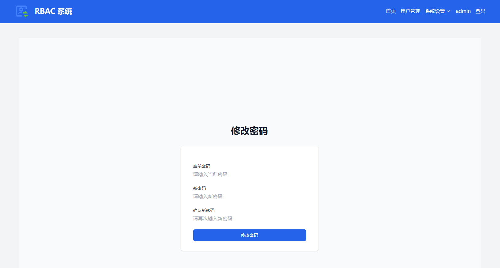

## rbac_demo
## 介绍
rbac_demo是一个django 项目，用于演示django的rbac权限管理。包括角色、权限、用户、日志等模块。通过管理角色，可以对用户进行授权，从而实现权限管理。
## 目录结构
```
rbac_demo
├── accounts
├── log
├── static
├── templates
├── rbac_demo
├── manage.py
├── requirements.txt
├── README.md
```

## 快速开始
### 运行环境
* python3.9
* django4.2.17
* sqlite3
### 安装依赖包
* pip install -r requirements.txt
### 迁移数据库
* python manage.py makemigrations
* python manage.py migrate
### 创建管理员账号(username:admin,password:admin123)
* python manage.py setup_default
### 创建默认权限
* python manage.py create_default_permissions
### 运行
* python manage.py runserver

## 访问地址
* http://127.0.0.1:8000/

## 页面展示

#### 注册页面


#### 登录页面


#### 首页（登录后 包含数据统计，快速操作，最近活动）


#### 用户管理


#### 权限管理


#### 角色管理


#### 系统日志


#### 个人资料


#### 修改密码


#### 重置密码发送链接


#### 邮件发送成功


#### 重置密码发送邮件链接


#### 点击邮件链接重置密码


